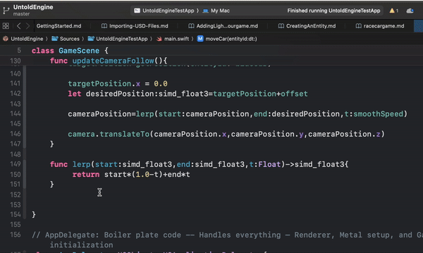
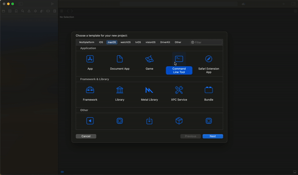

<h1 align="center">
  <a href="https://github.com/untoldengine/UntoldEngine">
    <!-- Please provide path to your logo here -->
    
  </a>
</h1>

<div align="center">
  <br />
  <a href="https://github.com/untoldengine/UntoldEngine/issues/new?assignees=&labels=bug&template=01_BUG_REPORT.md&title=bug%3A+">Report a Bug</a>
  ·
  <a href="https://github.com/untoldengine/UntoldEngine/issues/new?assignees=&labels=enhancement&template=02_FEATURE_REQUEST.md&title=feat%3A+">Request a Feature</a>
  .
  <a href="https://github.com/untoldengine/UntoldEngine/issues/new?assignees=&labels=question&template=04_SUPPORT_QUESTION.md&title=support%3A+">Ask a Question</a>
</div>

<div align="center">
<br />

[](LICENSE)

[](https://github.com/untoldengine/UntoldEngine/issues?q=is%3Aissue+is%3Aopen+label%3A%22help+wanted%22)
[](https://github.com/untoldengine)

</div>

<details open="open">
<summary>Table of Contents</summary>

- [About](#about)
- [Getting Started](#getting-started)
  - [Prerequisites](#prerequisites)
  - [Installation](#installation)
- [Core API Functions](#Core-API-Functions)
- [Creating a quick game](#Creating-a-quick-game)
- [Deep Dive into the engine](#Deep-dive-into-the-engine)
- [Roadmap](#roadmap)
- [Support](#support)
- [Project assistance](#project-assistance)
- [Contributing](#contributing)
- [License](#license)


</details>

---

## About

The Untold Engine is a 3D game engine for macOS/iOS devices, written in Swift and powered by Metal as its graphics library. Its primary goal is to simplify game development by providing an intuitive, easy-to-use API.

Author: [Harold Serrano](http://www.haroldserrano.com)

---

## Getting Started

### Prerequisites

To begin using the Untold Engine, you’ll need:

- An Apple computer.
- The latest version of Xcode, which you can download from the App Store.

### Installation

Follow these steps to set up and run the Untold Engine:

1. Clone the Repository

```bash
git clone https://github.com/untoldengine/UntoldEngine

cd UntoldEngine
```

2. Open the Swift Package

```bash
open Package.swift
```
3. Configure the Scheme in Xcode

- In Xcode, select the "UntoldEngineTestApp" scheme.
- Set "My Mac" as the target device.



4. Click on Run

You should see models being rendered.


### Controls:

- Press L to toggle "game mode." 
- In game mode, you should see one of the characters animating

---

## Core API Functions

The Untold Engine API is designed to make game development straightforward and efficient. Its key strength lies in its clear and consistent naming conventions, enabling developers to focus on building their game logic without worrying about complex engine details.

At its core, the API revolves around the Entity-Component-System (ECS) architecture, where you create entities and enhance them with components like meshes, physics, collisions, and animations. Let's break down the most commonly used API functions.

1. createEntity()

This function generates a new entity.
Think of it as creating a "placeholder" object in your game world.

```swift
let myEntity = createEntity()
```

2. setEntityMesh()

Attach a visual representation (a model) to your entity.
This is where your 3D model comes to life.

```swift
setEntityMesh(entityId: myEntity, filename: "myModel", withExtension: "usdc")
```

3. setEntityKinetics()

Enable physics for your entity, allowing it to move, fall, or be affected by forces.

```swift
setEntityKinetics(entityId: myEntity)
```

4. setEntityAnimation()

Add animations to your entity.
You provide an animation file and name it for easy reference.

```swift
setEntityAnimations(entityId: myEntity, filename: "walkAnimation", withExtension: "usdc", name: "walking")
```

### An Example: Creating a Player Character

Here’s how the API comes together to build a fully interactive player character:

```swift
// Step 1: Create the entity
let player = createEntity()

// Step 2: Attach a mesh to represent the player visually
setEntityMesh(entityId: player, filename: "playerModel", withExtension: "usdc")

// Step 3: Enable physics for movement and gravity
setEntityKinetics(entityId: player)

// Step 4: Add collision detection for interacting with the world
setEntityCollision(entityId: player)

// Step 5: Add animations for walking and running
setEntityAnimations(entityId: player, filename: "walkingAnimation", withExtension: "usdc", name: "walking")
setEntityAnimations(entityId: player, filename: "runningAnimation", withExtension: "usdc", name: "running")

// Step 6: Play an animation
changeAnimation(entityId: player, name: "walking")
```

## Creating a quick game

### Step 1 Create a macOS game in Xcode

- Open Xcode: File → New → Project.
- Select Command Line Tool under macOS.
- Click Next, name your game, and choose Swift as the language.



### Step 2: Add the Untold Engine as a Package Dependency

- Go to: File → Add Packages...

- Enter the repository URL:

https://github.com/untoldengine/UntoldEngine.git 

- Select the appropriate version or branch (e.g., main) and click Add Package.


---

### Step 3: Add boiler plate code to the AppDelegate

#### Main Setup

1. Open main.swift and import the required modules:

```swift
import Cocoa
import MetalKit
import UntoldEngine
```


2. Add the following boilerplate code to initialize the engine:

```swift
// AppDelegate: Boiler plate code -- Handles everything – Renderer, Metal setup, and GameScene initialization
class AppDelegate: NSObject, NSApplicationDelegate {
    var window: NSWindow!
    var metalView: MTKView!
    var renderer: UntoldRenderer!
    var gameScene: GameScene!

    func applicationDidFinishLaunching(_ notification: Notification) {
        
        print("Launching Untold Engine v0.2")

        // Create and configure the window
        window = NSWindow(
            contentRect: NSRect(x: 0, y: 0, width: 1280, height: 720),
            styleMask: [.titled, .closable, .resizable],
            backing: .buffered,
            defer: false
        )
        
        metalView = MTKView(frame: window.contentView!.bounds)
        metalView.device = MTLCreateSystemDefaultDevice()
        metalView.depthStencilPixelFormat = .depth32Float
        metalView.colorPixelFormat = .rgba16Float
        metalView.preferredFramesPerSecond = 60
        metalView.framebufferOnly = false

        // Initialize the renderer and set it as the MTKView delegate
        renderer = UntoldRenderer(metalView)
        renderer?.mtkView(metalView, drawableSizeWillChange: metalView.drawableSize)
        metalView.delegate = renderer

        // Create the game scene
        gameScene = GameScene()

        // Connect renderer callbacks to the game scene
        renderer.gameUpdateCallback = { [weak self] deltaTime in
            self?.gameScene.update(deltaTime)
        }
        renderer.handleInputCallback = { [weak self] in
            self?.gameScene.handleInput()
        }

        // Set up window and display it
        window.contentView = metalView
        window.makeKeyAndOrderFront(nil)
        window.center()
        window.title = "Untold Engine v0.2"

        NSApp.setActivationPolicy(.regular)
        NSApp.activate(ignoringOtherApps: true)
    }

    func applicationShouldTerminateAfterLastWindowClosed(_ sender: NSApplication) -> Bool {
        return true
    }
}

// Entry point

let app = NSApplication.shared
let delegate = AppDelegate()
app.delegate = delegate

app.run()
```


#### Add the GameScene Class

Add the GameScene class to main.swift:

```swift
class GameScene {

    init() {
        
    }
    
    func update(_ deltaTime: Float) {

    }

    func handleInput() {

    }

}
```


If everything was done correctly, you should see a window with a grid once you hit "Run".


---

### Adding game entities

Here’s how to load assets, create entities, and link models:

```swift

class GameScene{

    init(){

        // set camera to look at point
        camera.lookAt(
            eye: simd_float3(0.0, 7.0, 15.0), target: simd_float3(0.0, 0.0, 0.0),
            up: simd_float3(0.0, 1.0, 0.0)
        )

        // You can load the assets in bulk as shown here.
        // In this instance, stadium contains multiple assets which do not require an entity id to be assigned.
        loadBulkScene(filename: "stadium", withExtension: "usdc")

        // create an entity id for the blue player
        let bluePlayer = createEntity()

        // this function loads the usdc file and sets the mesh model to the entity
        setEntityMesh(entityId: bluePlayer, filename: "blueplayer", withExtension: "usdc")

        // translate the entity
        translateEntityBy(entityId: bluePlayer, position: simd_float3(3.0, 0.0, 0.0))

        // let's create another entity Id
        let redPlayer = createEntity()

        // load the usdc file and link the model to the entity
        setEntityMesh(entityId: redPlayer, filename: "redplayer", withExtension: "usdc", flip: false)

        // load and link the animation to the entity. You should give a name to the animation
        setEntityAnimations(entityId: redPlayer, filename: "running", withExtension: "usdc", name: "running")

        // set the animation to play. You reference the animaitons by name
        changeAnimation(entityId: redPlayer, name: "running")

        // enable physics/kinetics on the entity
        setEntityKinetics(entityId: redPlayer)

    }

}

```
### Adding a Sunlight Entity

And finally, let's add a Sun light entity.

```swift
class GameScene{

    init(){

        // ... other initializations ...
        
        // Create an entity for the directional light
        let sunEntity: EntityID = createEntity()

        // Create the directional light instance
        let sun: DirectionalLight = DirectionalLight()

        // Add the entity and the light to the lighting system
        lightingSystem.addDirectionalLight(entityID: sunEntity, light: sun)

    }

}
```

Click on Run and you should see the following:


---

## Deep Dive into the engine

The following articles can help you get a deeper understanding on how to use the Untold Engine for your game.

- [Getting Started](docs/GettingStarted.md)
- [Loading assets](docs/Importing-USD-Files.md)
- [Creating a game entity](docs/CreatingAnEntity.md)
- [Adding Light to your game](docs/AddingLighttoyourgame.md)
- [Detecting User Inputs](docs/DetectingUserInputs.md)
- [Enabling Physics](docs/physics.md)
- [Enabling Animation](docs/animation.md)

---

## Roadmap

See the [open issues](https://github.com/untoldengine/UntoldEngine/issues) for a list of proposed features (and known issues).

- [Top Feature Requests](https://github.com/untoldengine/UntoldEngine/issues?q=label%3Aenhancement+is%3Aopen+sort%3Areactions-%2B1-desc) (Add your votes using the 👍 reaction)
- [Top Bugs](https://github.com/untoldengine/UntoldEngine/issues?q=is%3Aissue+is%3Aopen+label%3Abug+sort%3Areactions-%2B1-desc) (Add your votes using the 👍 reaction)
- [Newest Bugs](https://github.com/untoldengine/UntoldEngine/issues?q=is%3Aopen+is%3Aissue+label%3Abug)

---

## Support

Reach out to the maintainer at one of the following places:

- [GitHub issues](https://github.com/untoldengine/UntoldEngine/issues/new?assignees=&labels=question&template=04_SUPPORT_QUESTION.md&title=support%3A+)

---

## Project assistance

If you want to say **thank you** or/and support active development of Untold Engine:

- Add a [GitHub Star](https://github.com/untoldengine/UntoldEngine) to the project.
- Tweet about the Untold Engine.
- Write interesting articles about the project on [Dev.to](https://dev.to/), [Medium](https://medium.com/) or your personal blog.

Together, we can make Untold Engine **better**!

---

## Contributing

Since this project has barely been released as an open-source, I am not taking Pull-Request yet. I want to complete the documentation and write more tutorials before allowing Pull-Request.

If you want to help out, I would appreciate if you could report back any bugs you encounter. Make sure to report them at our [Github issues](https://github.com/untoldengine/UntoldEngine/issues), so we all have access to them.

Thank you.

Once I feel that the documentation is ready, I will allow Pull-Request.

---

## License

This project is licensed under the **LGPL v2.1**.

This means that if you develop a game using the Untold Engine, you do not need to open source your game. However, if you create a derivative of the Untold Engine, then you must apply the rules stated in the LGPL v2.1. That is, you must open source the derivative work.

