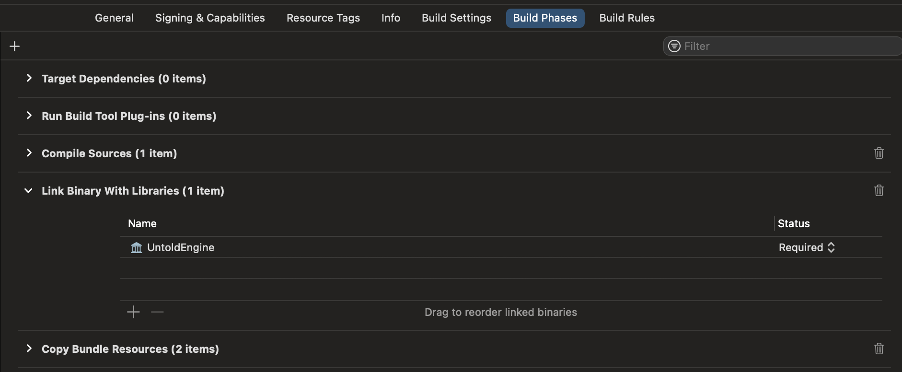

# Getting Started

Welcome to the **Untold Engine**! Follow these steps to set up your first macOS game project and get the engine running.

---

## Step 1: Create a macOS Game in Xcode

1. Open Xcode and navigate to:  
   **File → New → Project**.

2. Select **Game** under the macOS platform.

3. Click **Next** and provide a name for your game (e.g., "MyRacingGame").

4. Make sure to set:
   - **Language**: Swift  
   - **Game Technology**: Metal  

5. Click **Finish** to create your project.

---

## Step 2: Remove Default Files

When Xcode creates your game project, it generates some default files that are not needed for the Untold Engine. Delete the following files:

- `GameViewController.swift`  
- `Renderer.swift`  
- `Shaders.metal`  
- `ShaderTypes.h`

To remove them:
1. Right-click each file in the **Project Navigator**.
2. Select **Delete** and confirm.

---

## Step 3: Add the Untold Engine as a Package Dependency

To include the Untold Engine in your project:

1. Open your Xcode project (e.g., "MyRacingGame").  
2. Go to: **File → Add Packages...**  
3. In the search field, enter the Untold Engine repository URL:  
   `https://github.com/untoldengine/UntoldEngine.git`  
4. Xcode will fetch the package. Select the appropriate version or branch (e.g., `main`) and click **Add Package**.  
5. Choose the target (e.g., your macOS game project) and click **Add Package**.

---

## Step 4: Add Boilerplate Code to the AppDelegate

Now that the package is added, you can import the Untold Engine into your Swift files. The boilerplate code below initializes the engine and sets up a basic game scene.

### Update `AppDelegate.swift`

Replace the contents of `AppDelegate.swift` with the following:

```swift
import Cocoa
import UntoldEngine
import MetalKit

// The GameScene class is where you will declare and define your game logic.
class GameScene {
    init() {
        // Initialize game assets and logic here
    }

    func update(_ deltaTime: Float) {
        // Game update logic
    }

    func handleInput() {
        // Input handling logic
    }
}

@main
class AppDelegate: NSObject, NSApplicationDelegate {
    var window: NSWindow!
    var metalView: MTKView!
    var renderer: UntoldRenderer!
    var gameScene: GameScene!

    func applicationDidFinishLaunching(_ aNotification: Notification) {
        print("Launching Untold Engine v0.2")

        // Create and configure the window
        window = NSWindow(
            contentRect: NSRect(x: 0, y: 0, width: 1280, height: 720),
            styleMask: [.titled, .closable, .resizable],
            backing: .buffered,
            defer: false
        )
        
        metalView = MTKView(frame: window.contentView!.bounds)
        metalView.device = MTLCreateSystemDefaultDevice()
        metalView.depthStencilPixelFormat = .depth32Float
        metalView.colorPixelFormat = .rgba16Float
        metalView.preferredFramesPerSecond = 60
        metalView.framebufferOnly = false

        // Initialize the renderer and set it as the MTKView delegate
        renderer = UntoldRenderer(metalView)
        renderer?.mtkView(metalView, drawableSizeWillChange: metalView.drawableSize)
        metalView.delegate = renderer

        // Create the game scene
        gameScene = GameScene()

        // Connect renderer callbacks to the game scene
        renderer.gameUpdateCallback = { [weak self] deltaTime in
            self?.gameScene.update(deltaTime)
        }
        renderer.handleInputCallback = { [weak self] in
            self?.gameScene.handleInput()
        }

        // Set up window and display it
        window.contentView = metalView
        window.makeKeyAndOrderFront(nil)
        window.center()
        window.title = "Untold Engine v0.2"

        NSApp.setActivationPolicy(.regular)
        NSApp.activate(ignoringOtherApps: true)
    }

    func applicationWillTerminate(_ aNotification: Notification) {
        // Cleanup logic here
    }

    func applicationShouldTerminateAfterLastWindowClosed(_ sender: NSApplication) -> Bool {
        return true
    }
}
```

## Step 5: Run Your Game

1. Build and run your project in Xcode.

2. If everything was done correctly, you should see a window with a grid once you hit "Run".


---

## Common Issues

### ShaderType.h not found

Xcode may fail stating that it can't find a ShaderType.h file. If that is the case, simply go to your build settings, search for "bridging". Head over to 'Objective-C Bridging Header' and make sure to remove the path as shown in the image below


### Linker issues

Xcode may fail stating linker issues. If that is so, make sure to add the "Untold Engine" framework to **Link Binary With Libraries** under the **Build Phases** section.



Next: [Importing USDC Files](Importing-USD-Files.md)
