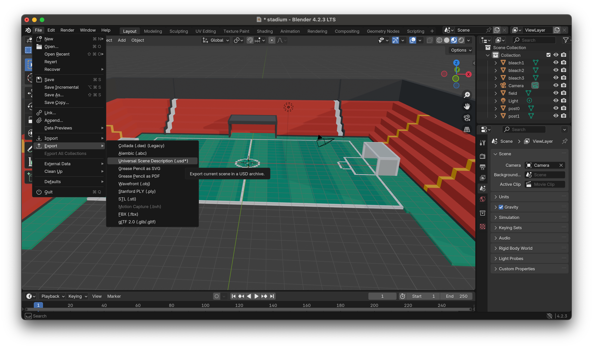
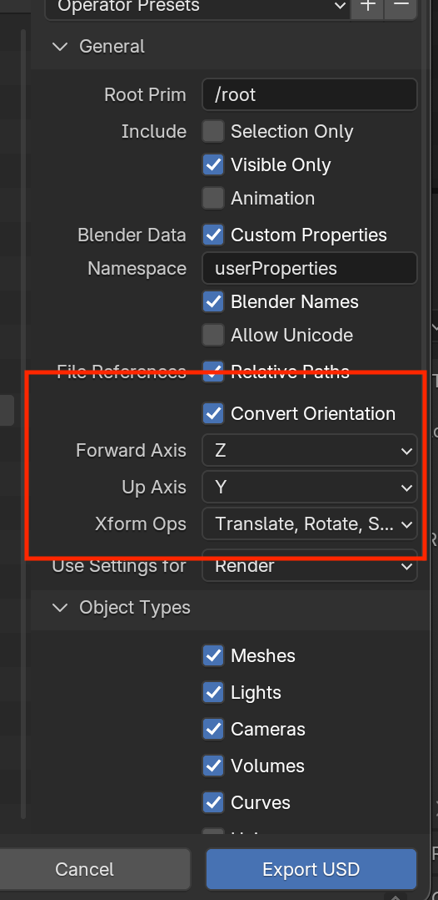
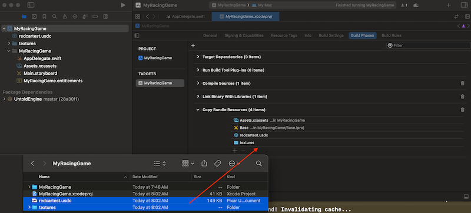
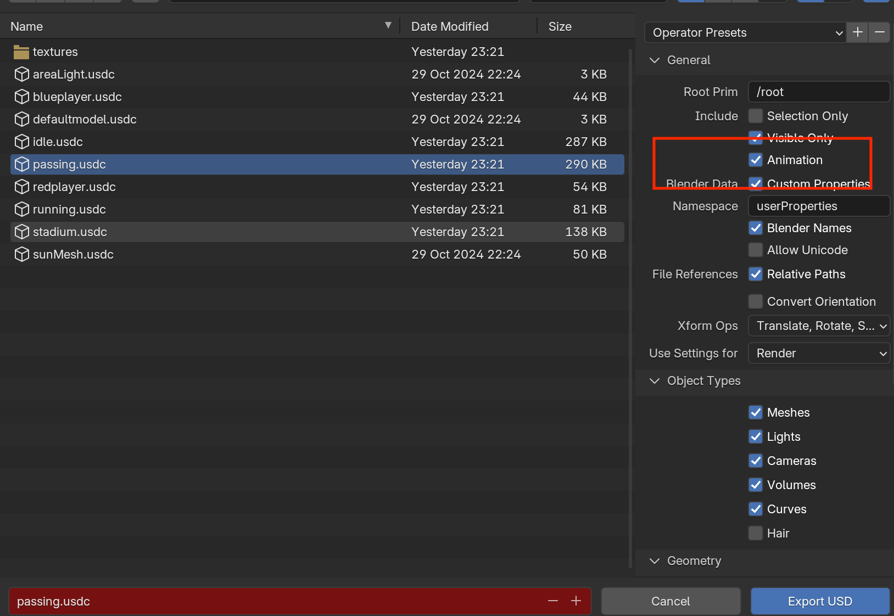

# Importing USDC files for your game

The Untold Engine supports .usdc files, making it easy to import 3D models and scenes into your game. This tutorial will guide you through the correct export settings in Blender, adding files to your project, and loading them into your game.

---

## Requirements

If exporting the files yourself, make sure to use Blender 4.2.3 or later

## How to export a file to USDC

The Untold Engine requires all files to be of type usdc. To export your model or scene from Blender, click on File->Export->USD

## Exporting models 

To ensure proper export of .usdc files from Blender:

1. Check the "Relative Paths" Option during export. This ensures that all referenced assets, such as textures, are correctly linked relative to the .usdc file.

2. The Untold Engine coordinate system follows a righ-hand coordinate system. +Y is up and +Z is forward (out of the screen). Unfortunately, Blender's coordinate system is +Z up and +Y is forward. While exporting make sure to set the coordinate system that corresponds to the Untold Engine as shown below:

3. Save the exported .usdc files into your project and ensure they are added to the main bundle, as shown below:

---

## Exporting models for Animation

Exporting models with animations require that you also export its rig/armature. During exporting, make sure to have "Rigging" selected.

---

## Exporting Animations

Similarly, to export an animation, make sure Animation is selected.

Next: [Creating a game entity](CreatingAnEntity.md)
Previous: [Getting Started](GettingStarted.md)
